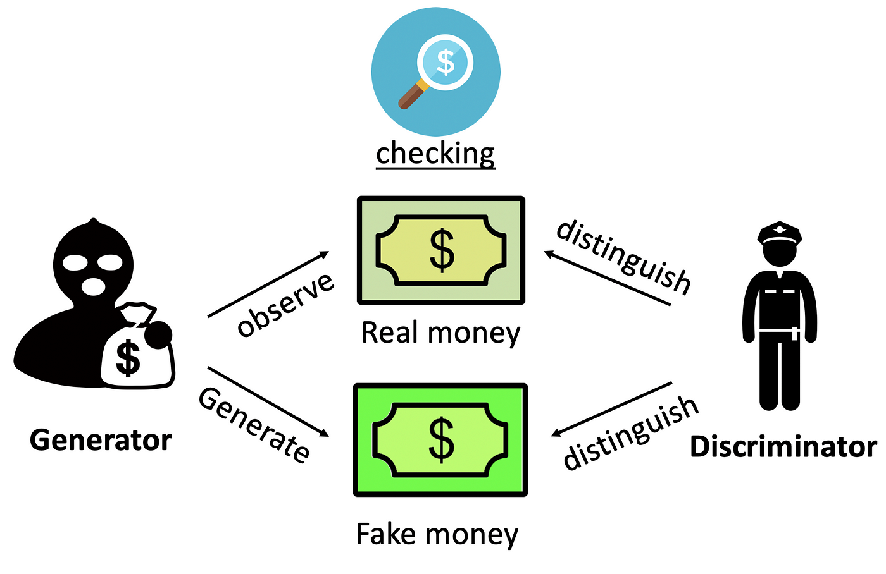

# GANs with Python

---

# Setup

1. Go to this link:
2. Log in to your Google account
3. Create a folder called `gans-workshop-files` in the top level of your Google Drive folder
4. Make sure your folder with 500 images is in here

---

# What are GANs?

- Generative Adversarial Networks (GANs)
- Two models trained simultaneously
- A Generator ("the artist") is trying to learn to create images that look real
- A Discriminator ("the art critic") is trying to tell real images apart from fakes

---

---

During training, the generator progressively becomes better at creating images that look real, while the discriminator becomes better at telling them apart. The process reaches equilibrium when the discriminator can no longer distinguish real images from fakes.

---

# MNIST Dataset

---

# This Person Does Not Exist

---

# This Person Should Not Exist

