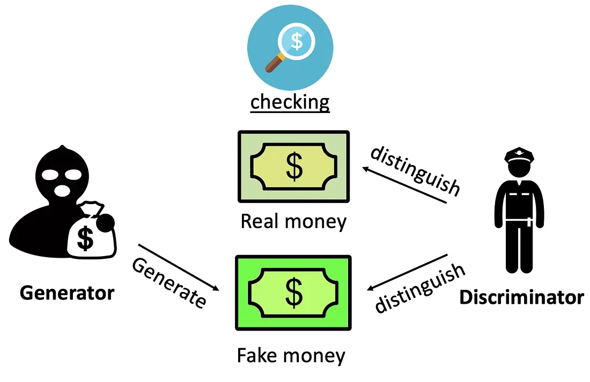

# GANs with Python

---

# Setup

1. Go to this link: **bit.ly/45svhk0**
2. Log in to your Google account

If you got some of your own files then...
1. Create a folder called `gans-workshop-files` in the top level of your Google Drive folder
2. Within that folder create another folder for your images. This can be named cats/trees/flowers/etc.

---

# What are GANs?

- Generative Adversarial Networks (GANs)
- Two neural networks trained simultaneously
- A Generator ("the criminal") is trying to learn to create fake images
- A Discriminator ("the detective") is trying to tell real images from the fake images

---

<style>
img[alt~="center"] {
  display: block;
  margin: 0 auto;
}
</style>



<!--
- The Criminal starts with "random data." This would be like drawing random images on a piece of paper while blindfolded.
- The Detective is presented with a real bank note and a fake note, and has to say which one it thinks is real.
- If the Detective can tell that they money is fake then the Criminal goes away and tries to get better at making fake money. The Detective got it right, so it doesn't change its behaviour.
- If the Detective can't tell that the counterfeit money is fake, then it tries to get better at spotting fake money. The Criminal doesn't change its behaviour because it was successful.
- After enough repetitions of this, we obtain "convergence" when the Criminal's fake money becomes so convincing that the Detective gives up on trying to tell what's what. All it can do is say there's a 50/50 chance because it's stumped.
 -->

---
# Lists Recap

In the previous workshop we covered Lists in Python. Lists are an ordered data structure that allow us to hold a collection of items.

```python
my_list = [1, 2, 3, 4, 5]
my_other_list = ["a", "b", "c"]
my_empty_list = []
```


---

# Arrays and Images

So for images we need something like a list for holding values for our pixels...


---
# Arrays and Images

In the code we will store our images in the form of something called _arrays_. Like Lists, they are able to hold a collection of values and store them in a single variable. But because we are dealing with images we need a "grid" (or more accurately several grids) rather than a simple list.


---
# Lists and Arrays

- Black and White images: 2D array for "brightness"
- Colour images: 3D array for RGB channels

The GAN has less work to do in the case of black and white images.

---

# MNIST Dataset


- MNIST is a well-known dataset of handwritten numbers
- Very popular for testing image processing code

---

# This Person Does Not Exist


---

# This Person Should Not Exist


---
# Loss Functions

Our loss functions allow us to see how well the Generator and Discriminator are doing.

$D(x)$ measures how confident the Discriminator is that a real image is authentic. The Discriminator wants this to be a higher value.
$D(G(z))$ measures how confident the Discriminator is that a fake image is authentic. The Generator wants this to be a higher value whereas the Discriminator wants this to be a lower value.

Hence the name adversarial...

---
# Loss Functions

## Discriminator Loss
$\frac{1}{m}\sum_{i=1}^m \log(D(x^i)) + \log(1 - D(G(z^i)))$

## Generator Loss
$\frac{1}{m}\sum_{i=1}^m \log(1 - D(G(z^i)))$

---
# Mathematical Optimisation

GANs are based on the maths of optimisation. The objective of optimisation is to find the best solution to problem.


The Discriminator wishes to maximise its loss function while the Generator wishes to minimise its loss function.

