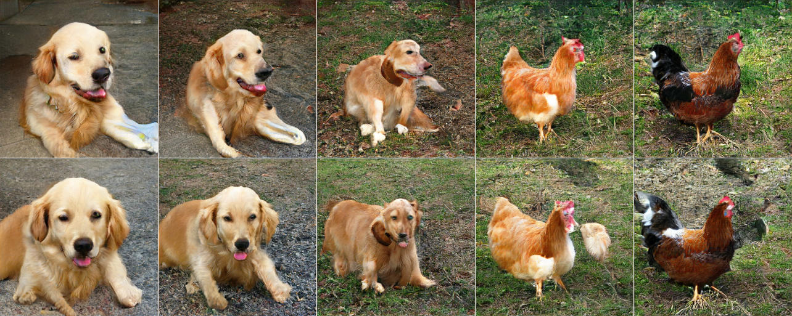

# GANs with Python

---

# Setup

**Note**: This workshop requires an understanding of basic Python. Experience from your own projects is fine.

1. Go to this link: **bit.ly/45svhk0**
2. Log in to your Google account.

If **do** you have some of your own files then...
1. Create a folder called `gans-workshop-files` in the _top level_ of your Google Drive folder.
2. Within that folder create another folder for your images. This can be named cats/trees/flowers/etc.

If you **don't** have some of your own files then...
1. Do nothing!

---

# What are GANs?

- GAN stands for Generative Adversarial Networks.
- They have exploded in popularity in quite a short time.
- It started in a pub...

So what does Generative Adversarial Network? Well let's start with the word _generative_...

---
# Generative?

**Generative:** Capable of producing or creating something.

- **Discriminative:** Identifies and distinguishes between categories, such as recognising that a cat is a cat and a dog is a dog.
- **Generative:** Generates new instances of cats or dogs by applying learned patterns.

Later, we'll explore how GANs actually combine these things.


---
# Adversarial?

**Adversarial:**  involving people opposing or disagreeing with each other.


---
# Network?

Neural networks are algorithms that endeavor to recognise the underlying relationships in a set of data.


---

# Putting it all together...

---

We are _generating_ fake data by using two neural _networks_ that have an _adversarial_ relationship.

---

# GAN Components

- A **Generator** ("the criminal") is trying to learn to create fake images
- A **Discriminator** ("the detective") is trying to tell real images from the fake images
- The two neural networks are _trained_ simultaneously

---

We can think of a GAN as being like a turn-based game...

---
# The GAN Game I

1) Our criminal creates a fake note
2) Our detective sees a real note and a fake note and is asked to tell which is which
3) The criminal "wins" a round of the game if it fools the detective
4) The detective "wins" a round of the game if it can spot the fake
5) The loser then goes away and changes their _strategy_ in the next round of the game but the winner simply carries on what it was doing before

---

<style>
img[alt~="center"] {
  display: block;
  margin: 0 auto;
}
</style>


<!--
- The Criminal starts with "random data." This would be like drawing random images on a piece of paper while blindfolded.
- The Detective is presented with a real bank note and a fake note, and has to say which one it thinks is real.
- If the Detective can tell that they money is fake then the Criminal goes away and tries to get better at making fake money. The Detective got it right, so it doesn't change its behaviour.
- If the Detective can't tell that the counterfeit money is fake, then it tries to get better at spotting fake money. The Criminal doesn't change its behaviour because it was successful.
- After enough repetitions of this, we obtain "convergence" when the Criminal's fake money becomes so convincing that the Detective gives up on trying to tell what's what. All it can do is say there's a 50/50 chance because it's stumped.
 -->

---
# The GAN Game II

- The game takes place for several turns (or epochs) (or iterations...)
  - For us this can mean leaving the code running for several hours...
- We want our detective to get smarter, because that means the criminal has more of a challenge and is forced to _get better_ at creating fake notes
- Ideally, what will happen is that the criminal's fake notes become so convicing that the detective can't tell the difference
---
# Types of GANs

---
# CycleGAN


The background is changed too.

---

# StyleGAN - This Person Does Not Exist


Created using the StyleGAN developed by Nvidia.

---

# StyleGAN - This Person Should Not Exist ??? 😱


---
# BigGAN



<!-- This is achieved with interpolation between different categories. -->

---
# So how does a program store an image?

---
# Lists Recap

In the previous workshop we covered Lists in Python. Lists are an ordered data structure that allow us to hold a collection of items.

```python
my_list = [1, 2, 3, 4, 5]
my_other_list = ["a", "b", "c"]
my_empty_list = []
```


---

# Image Data

So for images we ought to use something like a list for holding values for our pixels, but with something a bit more...


---
# Arrays and Images

In the code we will store our images in the form of something called _arrays_. Like Lists, they are able to hold a collection of values and store them in a single variable. But because we are dealing with images we need a "grid" (or more accurately several grids) rather than a simple list.


---
# Arrays and Images

- Black and White images: 2D array for "brightness"
- Colour images: 3D array for RGB channels

The GAN has _less work to do_ in the case of black and white images.

---


---

# MNIST Dataset


- MNIST is a well-known dataset of handwritten numbers
- Very popular for testing image processing code

---

# Basic Classification Example

https://www.3blue1brown.com/lessons/neural-networks

---
# Issues with GANs
---
# Mode Collapse


These are definitely ones...

---


---
# Convergence Failure

Convergence failure is what happens when the generator and discriminator do not reach balance during training.

## Discriminator Dominates

The detective becomes too smart too early in the game, so the criminal doesn't get a chance to properly learn what it should and shouldn't do to create convicing notes.

## Generator Dominates

The criminal gets too smart too early in the game, so it's able to get away with making "meh" notes as these are still enough to fool the detective.

---


---

# How do we know that our GAN is heading in a good direction?

---
# Mathematical Optimisation (or Min-Max Problems)

GANs are based on the maths of optimisation. The objective of optimisation is to find the best solution to problem.


---
# Gradient Descent


So what do we wish to "optimise" when running our GAN?

---
# Loss Functions

Our loss functions give us an indication of how well the Generator and Discriminator are performing.

- $x$ is a real image.
- $D(x)$ is the Discriminator's judgement on the real image.
- $z$ is random noise.
- $G(z)$ is the Generator's attempt at creating a fake image.
- $D(G(z))$ is the Discriminator's judgement on the fake image.

The Discriminator wants $D(x)$ to be high as possible. For $D(G(z))$ the Discriminator wants this to be as low as possible while the Generator wants this to be as high as possible.

---
# Loss Functions

## Discriminator Loss
$\frac{1}{m}\sum_{i=1}^m \log(D(x^i)) + \log(1 - D(G(z^i)))$

## Generator Loss
$\frac{1}{m}\sum_{i=1}^m \log(1 - D(G(z^i)))$

The Discriminator wishes to **maximise** its loss function while the Generator wishes to **minimise** its loss function.

---
# Convergence Failure
## Discriminator Dominates


---
# Convergence Failure
## Generator Dominates


---

# Now let's head over to the notebook...

<!-- ---
# Why Use the GPU?

- A good GPU is good at doing maths.
- For a game  -->

---

# Creative AI Stuff

---

# Artist + Machine Intelligence

https://ami.withgoogle.com/

---

# K Allado-McDowell


---

# Google DeepDream


---

# Sound of the Earth


https://soundoftheearth.org/

---
# Running the Code Locally

- Download Miniforge: https://github.com/conda-forge/miniforge
- Clone my repo: https://github.com/DolicaAkelloEgwel/gans-workshop
- Make sure you've installed the Python extension in VSCode
- Use `where` (Windows) in the Miniforge prompt
- Use this path in VSCode as your Conda path
- In Miniforge prompt, create an environment with the `environment.yml` file
- In VSCode, refresh available interpresters, then use the `gans-environment` as your Python Interpreter
---
# Kaggle
---


---
“You can think of generative models as giving artificial intelligence a form of **imagination**.” - Ian Goodfellow